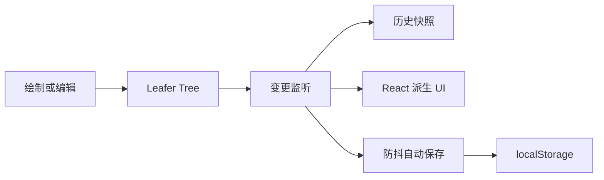

# AidCanvas 架构设计

> 本文保留早期单机架构说明，不是 0.2.0 宿主协同契约。Doca 模式以 Yjs 模型为事实来源、禁用 localStorage/自动保存，资源只持久化稳定 path；当前入口与行为见 [SDK_DESIGN](SDK_DESIGN.md)、[COLLABORATION](COLLABORATION.md)。下文 Leafer 唯一事实来源、快照历史、Data URL 回写等只适用于旧单机路径。

## 目标与边界

AidCanvas 只负责画布创作，不承担账号、项目后台、AI 对话或协作服务。当前版本采用 local-first 模式，可离线编辑并通过 JSON 文件迁移数据。

画布同时以 `CanvasEditor` React 组件作为 npm SDK 输出。应用页面只是该组件的默认宿主；业务扩展通过 props、ref、存储适配器和协同 Provider 接入，不能直接依赖内部 Leafer 对象。公共接口详见 [SDK_DESIGN.md](SDK_DESIGN.md)。

## 目录结构

```text
src/
├── index.ts                        # npm 包唯一公共入口
├── sdk/
│   ├── index.ts                    # 公共导出
│   └── types.ts                    # Props、Ref、扩展与适配器协议
├── editor/
│   ├── core/                       # 文档格式与历史记录
│   ├── ui/                         # SDK 自有基础 UI
│   └── runtime/
│       ├── CanvasEditor.tsx        # 编辑器生命周期与功能编排
│       ├── components/             # 工具栏、图层、属性面板
│       ├── plugins/                # 内置元素插件
│       └── utils/                  # 样式与渲染工具
└── demo/
    └── DemoApp.tsx                 # 本地开发演示，不进入公共 API
```

根目录 `App.tsx` 和 `main.tsx` 只负责启动 demo；npm library 从 `src/index.ts` 构建，二者不会互相导入。业务代码只能从包公共入口使用 SDK，不能依赖 `editor/runtime` 内部路径。

## 状态设计

编辑期间 Leafer Tree 是场景数据的唯一事实来源。React 只保存 UI 派生状态：

- 当前工具；
- 当前选区；
- 图层列表；
- 保存状态；
- 历史栈可用状态。

不再使用 Redux 镜像每个元素，避免 Leafer 和业务 Store 之间产生双写与状态漂移。

## 编辑器布局

- 顶部应用栏只承载保存、导入和导出等文件级操作。
- 画布顶部中央浮层承载选择、元素创建、图片、橡皮擦、撤销和重做。
- 元素属性在画布左侧按需浮现，不永久占用画布宽度。
- 图层面板暂时固定在右侧，后续可收纳为可折叠调试面板。
- 缩放与适应内容位于画布左下角。
- 固定尺寸的 `.canvas-host` 只负责视口与裁剪，Leafer 使用内层 `.canvas-view` 渲染；不得再次把渲染节点直接作为布局容器，否则引擎写入的尺寸会导致页面随缩放漂移。
- 画布移动、缩放以及编辑器变换事件都通过 `requestAnimationFrame` 驱动选区操作条更新；操作条已挂载时直接更新 DOM 坐标，避免等待历史记录的防抖提交。
- 工具状态通过 `data-active-tool` 映射光标：选择、抓手、铅笔、橡皮擦、文本和形状绘制各自使用匹配的鼠标反馈。

该布局参考 Excalidraw 的高频操作就近原则，但元素模型、插件协议和视觉实现保持独立。

## 文档格式

```ts
interface CanvasDocument {
  version: number
  name: string
  updatedAt: string
  scene: IUIJSONData
}
```

`scene` 是 Leafer 可序列化场景。外层协议负责版本、名称和更新时间。增加字段或调整元素结构时，应新增 `migrateDocument()`，不能直接破坏旧文件。

## 变更链路



历史记录最多保存 80 个场景快照。撤销和重做恢复场景时会抑制变更监听，避免把恢复动作再次写入历史。

## 插件协议

每种元素工具实现：

- `AddMenu`：工具栏入口和创建交互；
- `styleControlKeys`：该元素支持的属性；
- `customStyleControlRenders`：专属属性控件；
- `RegisterEvent`：全局交互，例如双击创建文本；
- 自定义样式 getter/setter：解决 UI 属性和 Leafer 属性不一致的问题。

新增元素类型应通过插件注册，不在主组件中堆叠创建逻辑。

内置插件协议只服务包内部。业务自定义元素使用公开的 `CanvasElementExtension`，定义元素类型、工具栏图标、快捷键、拖拽创建工厂和属性控件。创建工厂返回标准 Leafer JSON，因此元素仍进入统一文档、历史、选区、Frame、导出与协同链路；属性 setter 返回 JSON patch，不暴露内部 Leafer 实例。

当前插件包括矩形、椭圆、直线、箭头、自由画笔、文本、多边形、星形、Frame、图片和橡皮擦。通用样式控制器负责描边、填充、线宽、虚实线、圆角、边数、字重和透明度。

界面不依赖通用组件库，基础按钮、面板和表单控件由项目内部维护，图标统一使用 IconPark React。这样既避免整套 UI 库进入画布包，也让交互尺寸、激活态和浮层风格可以围绕画布独立演进。

Frame 是可序列化的容器节点：既可直接拖拽创建，也可从当前选区生成，并把选中元素迁入 Frame。其 `overflow: hide` 提供子画布裁剪边界；Frame 内置独立的 `frame-title` 文字子节点，可双击原位编辑。透明背景使用显式透明色并关闭填充命中，避免 Frame 内部空白区域遮成白色或拦截框选。取消 Frame 时删除标题和容器、把实际内容以世界坐标原位释放到主画布。后续的嵌套导航和按 Frame 导出均在此数据模型上扩展。

指针释放后，编辑器以元素世界坐标包围盒中心判断 Frame 归属：进入 Frame 自动 `dropTo(frame)`，移出边界自动 `dropTo(tree)`，在 Frame 范围内新建的元素同样自动归入 Frame。重挂载由 Leafer 负责保持世界坐标，因此元素视觉位置不会跳变。

自由画笔属于连续工具，完成单次笔画后保持激活；选择、矩形等一次性工具完成创建后返回选择模式。这个差异由各插件自行控制，不在主组件中硬编码。

## 手绘渲染

矩形、椭圆、直线、箭头、多边形、星形和 Frame 支持“标准 / 手绘”绘制风格切换。所有手绘轮廓均由 Rough.js Generator 的原生 `rectangle`、`ellipse`、`polygon`、`line` 或 `path` 生成，再归一化回元素逻辑边界；固定 seed 保证重复生成结果稳定。手绘元素使用 Leafer 的 `editSize: 'scale'` 变换缩放，避免控制点改写自定义 Path 后又被原始图元宽高重置；退出手绘时恢复元素先前的缩放策略。元素仍属于原场景树，可以继续选择、移动、缩放、旋转、保存和导出。有填充色的封闭图形使用 Rough.js 原生 `hachure`、`cross-hatch`、`zigzag`、`dots` 或 `solid` 填充。除实色外，纹理间距和笔触尺寸按元素显示尺寸计算，并在缩放结束后重新生成。

手绘填充由 Rough.js 在 24×24 的离屏 Canvas 上同步绘制，再转换为 PNG Data URL，并在 Leafer ImagePaint 上使用 `format: 'png'` 与 `mode: 'repeat'`。这里刻意不使用 SVG Data URL，避免 Chromium、WebKit 与内置浏览器在 SVG 格式识别、复合 Path 填充规则和异步图片解码上的差异。

每个元素保存独立的 `roughSeed`，保证重新打开文档时笔触形状稳定；同时保存切换前的原始 Path，关闭手绘模式时恢复标准几何。手绘模式额外保存 `roughFillStyle`（斜线、交叉线、实色）和 `roughStrokeStyle`（轻微、自然、粗犷），这些控制项只在手绘模式显示。多边形边数和星形角数变化后会立即重新生成手绘 Path；闭合手绘 Path 每次生成后都会归一化到元素原有局部边界，避免调整边数或抖动强度时选框累计缩小。文字、图片和自由画笔不重复应用手绘风格。

## 特殊图形

工具栏图片按钮之后提供悬浮式特殊图形库。预设图形以归一化的 SVG Path 保存，当前包含心形、玫瑰花、太阳、云朵、闪电、月亮、对话气泡、皇冠、水滴和十字。创建后转换为普通 Leafer Path，继续复用统一的选择、移动、缩放、旋转、描边、填充、透明度、图层、Frame 归属、历史记录和文档序列化能力。图形类型同时写入元素 `data.specialShapeType`。特殊图形支持标准/手绘切换；手绘轮廓基于对应预设的闭合 Path 做确定性控制点扰动，避免 Rough.js 开放复合笔画破坏填充裁切，并兼容早期宽高布局与当前缩放布局两种文档数据。切换前后会根据 Leafer 的实际 Path 渲染边界反向校正缩放和位置，避免贝塞尔曲线极值变化造成累计尺寸漂移。

手绘线条强度变化同样经过实际边界校正，不会改变特殊图形的选框。属性面板通过 `ResizeObserver` 比较内容高度与可用容器高度，只在实际溢出时启用滚动。箭头元素通过 Leafer `endArrow` 属性提供无箭头、折线、实心三角、圆形和菱形五种端点样式。

## 文字与富文本

普通文字继续使用 Leafer `Text` 与官方 `TextEditor`，保证双击原位编辑、缩放、旋转和文档序列化稳定。属性层支持字体族、字号、字重、斜体、下划线/删除线、文字对齐、字间距、行高、颜色和透明度；这些都是整段文字属性。

真正的行内富文本（同一文本框内多字体、多字号、多颜色）不直接混入现有 `Text` 数据。后续阶段采用独立 `rich-text` 元素和分段 marks 数据模型，并以官方 `@leafer-in/html` 的 `HTMLText` 作为渲染候选。该插件通过 SVG 嵌入 HTML 且仅支持 Web；编辑时需要独立 DOM 编辑器、HTML 白名单清洗、选区到 marks 的映射，以及导出/反序列化兼容，因此在完成这些约束前不替换当前稳定的 TextEditor。

所有选中元素都通过顶部旋转控制点直接旋转，不在属性面板重复提供角度控件。旋转变更继续进入统一历史记录和自动保存链路。

## 存储与安全

- 自动保存只写当前浏览器的 localStorage，不上传任何数据。
- 图片当前以内嵌 Data URL 保存，适用于小型本地画布；图片节点记录原始尺寸，属性面板只负责原始比例复位、比例锁定、自由变形和透明度。大文件素材库阶段应切换至 IndexedDB Blob 和对象 URL。
- JSON 导入只接受当前文档版本，并在解析失败时保持现有画布不变。
- 导出与恢复均从 Leafer Tree 读取，不维护第二份场景数据。

## 图片编辑规划

图片内容编辑与画布元素编辑隔离。单选图片后由元素下方“编辑图片”按钮打开独立 HTML Canvas 弹窗；弹窗内部完成像素级预览，确认时输出新的 PNG Data URL，并只回写当前 Leafer Image 元素。画布不保存临时裁剪框、滤镜控制器或内部变换对象，从而避免 Image `url` 与 ImagePaint `fill` 互斥、历史记录污染及选框布局异常。旧试验数据若包含 ImagePaint，会在加载时自动迁回稳定的 URL 图片模型。

当前弹窗采用 Cropper.js 2.x 提供自由/原始/1:1/4:3/16:9/自定义比例裁剪、八点缩放、裁剪框与图片平移、滚轮缩放、水平/垂直翻转和 90° 旋转。原生 Canvas 负责亮度、对比度、饱和度、色相、模糊、灰度、棕褐色与 PNG 编码，并支持按住对比原图。能力基线继续参考 TOAST UI Image Editor、Filerobot 和 miniPaint 的绘制、形状、文字、蒙版和丰富滤镜；第三方编辑器节点只能存在于弹窗 DOM，不得进入 Leafer 场景树。

## 质量门槛

每次提交至少运行：

```bash
yarn type-check
yarn lint
yarn build
```

涉及交互时还应验证绘制、选中、样式修改、撤销重做、刷新恢复和导出。
